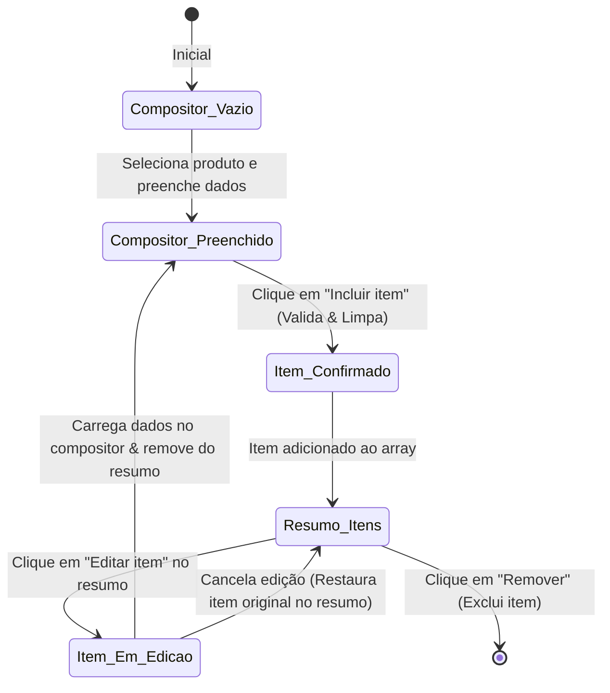

# State and Data Model: Refinamento do Fluxo de Nova Venda

**Feature**: [Refinamento do Fluxo de Nova Venda](spec.md)

Este documento descreve os estados de interface, estruturas de dados locais e os contratos de validação aplicados no frontend para suportar a feature 022.

---

## 1. Estruturas de Dados Locais (Frontend)

Não há alterações no banco de dados para esta feature, pois a mesma visa otimizar a experiência operacional do frontend consumindo as APIs de Venda e Cliente existentes.

### 1.1 VendaDraft (Estado Geral do Formulário)
Representa o rascunho completo da venda sendo preenchida.

| Campo | Tipo | Validação | Descrição |
|---|---|---|---|
| `clienteId` | `string` | Obrigatório, deve ser um GUID válido. | ID do cliente selecionado. |
| `dataVenda` | `string` | Opcional, formato `YYYY-MM-DD`. | Data de registro da venda. |
| `desconto` | `string` | Opcional, decimal maior ou igual a zero. | Desconto geral aplicado sobre o total líquido. |
| `acrescimo` | `string` | Opcional, decimal maior ou igual a zero. | Acréscimo geral aplicado sobre o total líquido. |
| `items` | `SaleItemDraft[]` | Deve conter pelo menos 1 item confirmado. | Array de itens confirmados no resumo. |

### 1.2 SaleItemDraft (Estado de Item Confirmado / Em Composição)
Representa a estrutura de dados de um item da venda.

| Campo | Tipo | Validação | Descrição |
|---|---|---|---|
| `id` | `string` | Identificador único local gerado (UUID). | ID para controle de renderização e chaves. |
| `produtoId` | `string` | Obrigatório. | ID do produto selecionado. |
| `quantidade` | `string` | Obrigatório, inteiro maior que zero. | Quantidade física de itens. |
| `precoUnitario` | `string` | Obrigatório, decimal maior ou igual a zero. | Preço cobrado por unidade. |
| `desconto` | `string` | Opcional, decimal maior ou igual a zero. | Desconto aplicado a esta linha de item. |
| `acrescimo` | `string` | Opcional, decimal maior ou igual a zero. | Acréscimo aplicado a esta linha de item. |

### 1.3 ClienteModalDraft (Cadastro Rápido de Cliente)
Representa os campos temporários de cadastro rápido no modal.

| Campo | Tipo | Validação | Descrição |
|---|---|---|---|
| `nome` | `string` | Obrigatório, não nulo ou vazio. | Nome completo do cliente. |
| `email` | `string` | Opcional, formato de email padrão. | Endereço de correio eletrônico. |
| `telefone` | `string` | Opcional, formato de telefone. | Número de telefone de contato. |

---

## 2. Validações e Fluxo de Estado

### 2.1 Validação do Compositor de Item (Antes da Inclusão)
- **Produto**: Deve estar selecionado (`produtoId !== ""`).
- **Quantidade**: Deve ser um número inteiro válido e maior que zero.
- **Preço Unitário**: Deve ser um número válido e maior ou igual a zero.
- **Desconto do Item**: Se informado, deve ser maior ou igual a zero.
- **Acréscimo do Item**: Se informado, deve ser maior ou igual a zero.
- **Duplicidade**: O `produtoId` selecionado não pode existir no array `VendaDraft.items`. Caso exista, o compositor exibe o erro: *"Produto já adicionado. Por favor, edite o item na lista do resumo."*

### 2.2 Transição de Edição de Item

- Quando um item entra em **Edição**, ele é retirado do resumo e colocado no compositor.
- Se o usuário selecionar um produto diferente enquanto edita, o item anterior ainda permanece fora do resumo.
- Ao clicar em **Cancelar Edição** ou redefinir o compositor, o item original é restaurado com seu estado inicial na lista de itens.
- Ao clicar em **Salvar Edição/Incluir**, o novo estado do compositor é validado e incluído no resumo, limpando o compositor.
