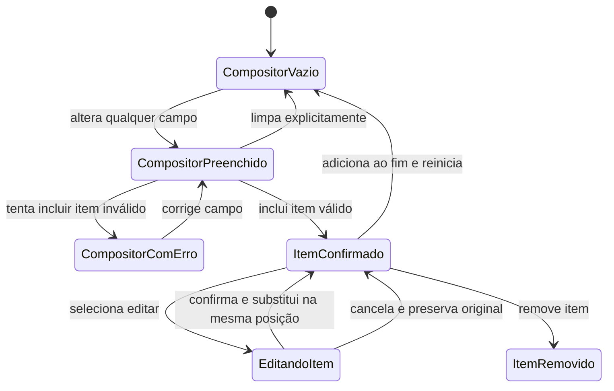

# State and Data Model: Refinamento do Fluxo de Nova Compra

**Feature**: [Refinamento do Fluxo de Nova Compra](spec.md)

Não há alteração de banco de dados ou entidades persistidas. Este documento modela somente o estado transitório da tela e sua transformação para o contrato já existente.

## 1. PurchaseDraft

Representa os dados gerais e os itens já confirmados para registro.

| Campo | Tipo | Validação | Papel |
| --- | --- | --- | --- |
| `fornecedorId` | `string` | Obrigatório e presente nas referências carregadas | Fornecedor da compra |
| `dataCompra` | `string` | Obrigatória, data válida | Data comercial |
| `desconto` | `string` | Vazio ou decimal não negativo | Ajuste geral |
| `acrescimo` | `string` | Vazio ou decimal não negativo | Ajuste geral |
| `items` | `PurchaseItemDraft[]` | Ao menos um item confirmado e todos válidos | Carrinho ordenado |

O estado inicial usa a data corrente e `items: []`.

## 2. PurchaseItemDraft

Estrutura existente usada tanto pela cópia editável no compositor quanto pelos itens confirmados.

| Campo | Tipo | Validação | Papel |
| --- | --- | --- | --- |
| `id` | `string` | Identificador local único | Identidade e substituição estável |
| `produtoId` | `string` | Obrigatório, existente e não duplicado | Produto na unidade principal |
| `quantidade` | `string` | Inteiro maior que zero | Quantidade comprada |
| `custoUnitario` | `string` | Decimal maior ou igual a zero | Custo por unidade principal |
| `desconto` | `string` | Vazio ou decimal não negativo | Desconto do item |
| `acrescimo` | `string` | Vazio ou decimal não negativo | Acréscimo do item |

O item vazio possui novo `id` e todos os campos comerciais em branco.

## 3. Estado do compositor

| Campo | Tipo | Regra |
| --- | --- | --- |
| `composerItem` | `PurchaseItemDraft` | Cópia mutável que ainda não participa do payload |
| `editingItemId` | `string \| null` | Identifica edição ativa; `null` significa nova inclusão |
| `errors` | `PurchaseValidationError[]` | Erros gerais ou associados ao `composerItem.id` |

Estados derivados:

- `isEditing`: verdadeiro quando `editingItemId` não é nulo.
- `composerHasContent`: verdadeiro quando qualquer campo comercial possui conteúdo após remoção de espaços.
- `canSubmitDraft`: verdadeiro quando os dados gerais e todos os itens confirmados são válidos, existe ao menos um item, não há edição ativa e o compositor não possui conteúdo.
- `productsById`: mapa consultivo para exibir nomes no resumo.

## 4. Transições

### Inclusão

1. Validar `composerItem` contra produtos e itens confirmados.
2. Se válido, anexar o item ao final de `draft.items`.
3. Criar novo item vazio e limpar erros relacionados.

### Início de edição

1. Localizar o item confirmado pelo identificador.
2. Copiar seus campos para `composerItem` sem remover o original.
3. Definir `editingItemId` e impedir uma segunda edição simultânea.

### Confirmação da edição

1. Validar a cópia, ignorando o próprio identificador na verificação de duplicidade.
2. Substituir por `id` no mesmo índice do array.
3. Limpar `editingItemId`, compositor e erros relacionados.

### Cancelamento

1. Não alterar `draft.items`.
2. Limpar `editingItemId`, compositor e erros relacionados.

### Remoção

1. Remover pelo identificador.
2. Recalcular imediatamente os valores derivados.
3. Se o carrinho ficar vazio, impedir o registro final.

## 5. Transformação para o contrato oficial

Somente `draft.items` é transformado no payload. `composerItem`, `editingItemId` e identificadores locais não são enviados.

| Origem local | Destino oficial |
| --- | --- |
| `draft.fornecedorId` | `fornecedorId` |
| data ISO derivada de `draft.dataCompra` | `dataCompra` |
| ajuste geral normalizado | `desconto`, `acrescimo` |
| cada item confirmado | `items[]` |
| número derivado de `quantidade` | `items[].quantidade` |
| número derivado de `custoUnitario` | `items[].custoUnitario` |
| ajustes normalizados | `items[].desconto`, `items[].acrescimo` |

## 6. Cálculos consultivos

- Bruto do item: `quantidade × custoUnitario`.
- Líquido do item: bruto menos desconto do item mais acréscimo do item.
- Subtotal líquido: soma dos líquidos confirmados.
- Total preenchido: subtotal líquido menos desconto geral mais acréscimo geral.

Valores vazios ou inválidos são exibidos como zero somente na prévia. Eles continuam inválidos para inclusão ou registro quando o campo for obrigatório.

## 7. Invariantes preservados

- Um produto aparece no máximo uma vez na compra.
- Quantidade é inteira, positiva e na unidade principal.
- O carrinho local não cria estoque nem custo.
- A compra registrada permanece em trânsito.
- Somente recebimento físico confirmado cria entrada e participa do custo médio.
- Perda, extravio e avaria não criam entrada.
- Nenhum estado transitório altera Venda ou dados históricos.

