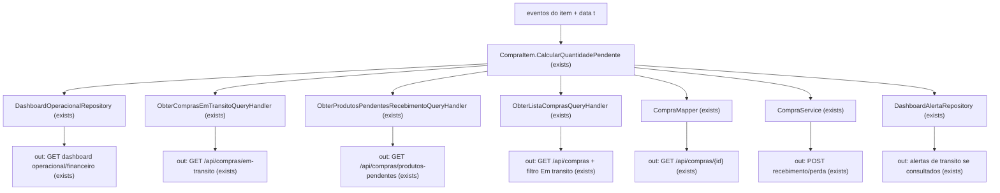

# Consistência de devoluções em trânsito

**Branch**: `fix/compras-devolvidas-em-transito`  
**Date**: 2026-09-20  
**Feature**: `specs/028-consistencia-devolucoes-transito/`  
**tlc-spec-lean profile (floor)**: `standard` — aprovado com o PLAN em 2026-09-20.

F027 já persiste devoluções anteriores ao recebimento e descreve a pendência líquida. Os consumidores de trânsito não usam a mesma fórmula. Esta feature reconcilia a leitura; não abre módulo novo e não reescreve eventos.

Fechamentos aprovados com o PLAN: sem novo projeto/framework de testes; sem novo membro de `CompraStatus` (a identificação “Devolvida antes do recebimento” é derivada); sem migration, datafix ou reescrita de eventos/status históricos.

## Problem

Hoje a mesma compra pode ser mercadoria em trânsito no Dashboard, na lista filtrada e nos cards patrimoniais, e ao mesmo tempo ter pendência logística zero no detalhe. O operador e o gestor pagam com patrimônio inflado e com fila operacional de compras que já foram recusadas.

A auditoria produtiva de 2026-09-20 (somente leitura, `transaction_read_only=on`) mediu o impacto: **12 itens**, **10 compras**, **61 unidades** ainda somadas como pendentes pela fórmula legada `Q - R - P`, com pendência líquida **0** em todos os 12 e **0** itens com saldo líquido negativo. Os 12 têm recebida=0, perdida=0, devolução posterior vigente=0 e status persistido `EmTransito`.

Quem usa o produto vê unidades recusadas como se ainda fossem chegar. Quem opera recebimento/perda pode, por API, aceitar quantidade já encerrada por recusa, porque a validação de escrita ainda ignora `DA`.

Quando esta feature existir, trânsito vigente será uma só quantidade em Dashboard, lista, detalhe, APIs de trânsito, recebimento e perda. Compra recusada por completo antes de receber some do filtro "Em trânsito" e dos cards, e aparece como "Devolvida antes do recebimento". Histórico permanece. Reembolso continua independente.

## Flow

Reuses `CompraItem.CalcularQuantidadePendente`, `CompraCalculoFinanceiro`, a seleção já líquida de `CompraRepository.ObterComprasEmTransitoAsync` e a definição de `DA` vigente já usada por `DashboardAlertaRepository`. Does not add a persisted balance.

1. in: item with `Q`, recebimentos até `t`, perdas até `t`, devoluções `AntesDoRecebimento` vigentes em `t` -> `CompraItem.CalcularQuantidadePendente` (exists) - returns `Q - R(t) - P(t) - DA(t)` without treating posterior returns as a second discount
2. `DashboardOperacionalRepository` (exists) - SQL prefilter keeps purchases with at least one item where `Q - R(t) - P(t) > 0` (superset of vigente), loads those purchases' items, then applies `DA(t)` so cards use `Q - R(t) - P(t) - DA(t)` for custo rateio and `pendente × PrecoVenda` for venda
3. `ObterComprasEmTransitoQueryHandler` (exists) - membership already uses `DA`; `ValorPendenteCusto` stops using `CompraItemCalculoFinanceiro.FromEntity` (which reads `QuantidadePendente` without `DA`) and uses the vigente quantity
4. `ObterListaComprasQueryHandler` (exists) - adds `PossuiPendenciaVigente` from the same formula; `SituacaoLogisticaDevolucao` sees anterior returns; `Status` stays the persisted `CompraStatus`
5. `CompraMapper` (exists) - detail `QuantidadePendente` and logistic tag match the list; detail `Status` stops mapping "pendency 0 because of `DA`" to `Recebida`
6. `CompraService` (exists) - `ValidarRecebimento` / `ValidarPerda` receive vigente `DA` inside the existing Serializable transaction
7. out: screens consume backend fields; frontend filter "Em trânsito" uses `PossuiPendenciaVigente`, not `status === EmTransito`

## Impact

| Front | What changes |
| --- | --- |
| domain | existing term: `Mercadoria em trânsito` already means vigente pendency after receipts, losses and recusas; Dashboard, lista filtrada and `FromEntity` still branch on `Q - R - P` or on persisted `CompraStatus.EmTransito` |
| domain | existing term: `CompraStatus.EmTransito` remains the F003 persisted machine (receipts/losses). Vigente membership is no longer that enum. This feature SHALL NOT add a `CompraStatus` member for devolução/recusa. Callers today: `ObterListaComprasQueryHandler`, frontend `purchase.status === filters.status`, `CompraMapper` detail status |
| domain | existing term: `SituacaoLogisticaDevolucao` today ignores anterior returns, so a full recusa shows `SemDevolucao`. It gains `DevolvidaAntesDoRecebimento` and uses `ParcialmenteDevolvida` when `DA` is partial and pendency remains. Callers: lista, detalhe, `purchase-list.tsx`, `purchase-detail.tsx` |
| stored data | nothing to migrate; no backfill; the 12 audited items already have the `DA` rows needed to recompose pendency 0. Reads change. Writes of recebimento/perda start rejecting over-`DA` quantities |

## Relations

None - no stored-data shape change

Pendência, membership and tags remain derived. `Compra`, `CompraItem`, `CompraItemRecebimento`, `CompraItemPerda`, `CompraItemDevolucao` and `CompraItemDevolucaoCompensacao` keep current cardinality. One-way constraints already in F027 (`OperacaoId` unique, at most one compensação per devolução) stay.

## Surface

Only routes whose response vocabulary or filter semantics change. Dashboard GETs keep the same keys and are Impact.

| Route | In | Out | Status |
| --- | --- | --- | --- |
| `GET /api/compras` | `dataInicio`, `dataFim`, `fornecedorId` (unchanged) | existing list fields plus `possuiPendenciaVigente`; `situacaoLogisticaDevolucao` may be `DevolvidaAntesDoRecebimento` | `200`, `401` |
| `GET /api/compras/{id}` | `id` | `status` = persisted `CompraStatus`; `quantidadePendente` with `DA`; `situacaoLogisticaDevolucao` same codes as the list | `200`, `400`, `401`, `404` |
| `GET /api/compras/em-transito` | none | only purchases with vigente pendency > 0; `valorPendenteCusto` uses that quantity in the F026 rateio | `200`, `401` |
| `POST /api/compras/{compraId}/itens/{itemId}/recebimentos` | `quantidade` | created receipt, or `{ error }` | `201`, `400`, `401`, `404`, `409` |
| `POST /api/compras/{compraId}/itens/{itemId}/perdas` | `quantidade` | created loss, or `{ error }` | `201`, `400`, `401`, `404`, `409` |

## Landing

| One-way door | Literal shape | Alternative rejected |
| --- | --- | --- |
| Pendência continua derivada | `pendencia(t) = Q - R(t) - P(t) - DA(t)` where `DA(t)` is sum of `CompraItemDevolucao` with `Momento = AntesDoRecebimento`, `DataDevolucao <= t`, and (`Compensacao` is null or `DataCompensacao > t`). No new column, table, view or migration | Persist `QuantidadePendente` or backfill `compras.Status` — needs a production datafix, rewrites the F003 machine, and cannot reconstruct history at a past `t` |
| Código logístico aditivo | `SituacaoLogisticaDevolucao = DevolvidaAntesDoRecebimento`, `DescricaoSituacaoLogisticaDevolucao = Devolvida antes do recebimento`. Derived from events. `enum CompraStatus` stays `Criada`, `EmTransito`, `ParcialmenteRecebida`, `Recebida`, `Finalizada`, `Cancelada` | New `CompraStatus` member persisted on `compras` — implied enum/migration and a mass `UPDATE` of the 10 audited purchases |
| Membership na lista | `CompraListDto.PossuiPendenciaVigente` (bool), computed with the formula above; frontend filter "Em trânsito" uses this field | Keep `purchase.status === "EmTransito"` — that is the confirmed filtered-list bug |

- Nothing else in this change is hard to reverse. Rollback is revert of the application. Schema and events stay. No feature flag: two formulas in production is the defect.

## Criteria

Grouped by slice. Numbering runs across the whole plan.

### S1: Cards de trânsito usam só a quantidade vigente (P1)

Dashboard operacional, Dashboard financeiro e patrimônio realista/potencial passam a valorizar somente unidades ainda pendentes.

**Acceptance Criteria**

1. The system SHALL compute vigente pendency per item at reference `t` as `Q - R(t) - P(t) - DA(t)`.
2. WHEN `GET /api/dashboard-gerencial/operacional` or `GET /api/dashboard-gerencial/financeiro` is queried at `t` THEN the system SHALL include in both transit cards only item quantities whose vigente pendency at `t` is greater than `0`.
3. WHEN an item has `R(t) = 0`, `P(t) = 0` and `DA(t) = Q` THEN the system SHALL contribute `0` units and `0` currency to "Mercadorias em transito ao custo" and "Mercadorias em transito a venda".
4. WHEN an item has `Q = 10` and `DA(t) = 4` with no receipt or loss THEN the system SHALL value the cost card with the F026 official rateio applied to `6 / 10` of that item, not `10 / 10`.
5. WHEN a pending item has no valid `PrecoVenda` THEN the system SHALL leave the sale-price transit value unavailable with the existing reason field and SHALL NOT invent a price.
6. IF a return after receipt exists THEN the system SHALL NOT subtract that quantity from vigente pendency.

**Independent test:** Recusa 4 of 10 before receipt; both cards move from 10 units to 6; recusa of the remaining 6 zeroes both cards; a later posterior return of received units does not reduce the still-pending remainder.

### S2: Filtro e listagens de trânsito usam a mesma membership (P1)

"Em trânsito" deixa de significar `CompraStatus` persistido.

**Acceptance Criteria**

7. WHEN the Compras screen filter "Em trânsito" is applied THEN the system SHALL list only purchases that have at least one item with vigente pendency greater than `0`.
8. WHEN `GET /api/compras/em-transito` is called THEN the system SHALL return the same membership as criterion 7 and SHALL omit items whose vigente pendency is `0`.
9. WHEN `GET /api/compras/produtos-pendentes` is called THEN the system SHALL return only items with vigente pendency greater than `0`.
10. WHEN a purchase has vigente pendency `0` on every item THEN the system SHALL exclude it from the filter "Em trânsito", from `GET /api/compras/em-transito` and from `GET /api/compras/produtos-pendentes`.
11. The system SHALL keep the unfiltered Compras 30-day window as a list window and SHALL NOT use it as the patrimonial reference `t`.
12. WHEN `GET /api/compras` returns a purchase THEN `possuiPendenciaVigente` SHALL be `true` if and only if at least one item has vigente pendency greater than `0`.

**Independent test:** Apply "Em trânsito" on the 10 fully refused purchases; they disappear. `GET /api/compras/em-transito` and produtos-pendentes agree. The unfiltered `/compras` 30-day transit window may also omit them; that window is list membership, not a requirement to keep RecusaTotal visible after clearing the filter. When a fully refused purchase is opened from a listing that returns it (for example `GET /api/compras` with a date or supplier filter) or from detail, the operational situation is "Devolvida antes do recebimento".

### S3: Identificação logística na lista e no detalhe (P1)

Lista e detalhe deixam de divergir sobre pendência e sobre recusa anterior.

**Acceptance Criteria**

13. WHILE a purchase has no receipt, no loss and `DA` vigente equal to every purchased unit THEN list and detail SHALL return `situacaoLogisticaDevolucao = DevolvidaAntesDoRecebimento` and `descricaoSituacaoLogisticaDevolucao = Devolvida antes do recebimento`.
14. WHILE a purchase has `DA` vigente on part of the quantity and vigente pendency greater than `0` THEN list and detail SHALL return `situacaoLogisticaDevolucao = ParcialmenteDevolvida` and `descricaoSituacaoLogisticaDevolucao = Parcialmente devolvida`.
15. WHEN item A has vigente pendency `0` by anterior return and item B still has vigente pendency greater than `0` THEN the purchase SHALL remain in transit for B only and SHALL NOT use `DevolvidaAntesDoRecebimento` at purchase level.
16. WHEN the same purchase is read from `GET /api/compras` and `GET /api/compras/{id}` at the same `t` THEN `quantidadePendente` (detail items) and `possuiPendenciaVigente` (list) SHALL agree, and both SHALL return the same `situacaoLogisticaDevolucao`.
17. IF vigente pendency is `0` only because of anterior returns and there is no receipt THEN list and detail SHALL NOT return `status = Recebida`.
18. The system SHALL keep `status` as the persisted `CompraStatus`, SHALL NOT add a `CompraStatus` enum member for devolução or recusa, and SHALL express “Devolvida antes do recebimento” only as derived `SituacaoLogisticaDevolucao`.

**Independent test:** Open one fully refused purchase from a listing that returns it (not the default unfiltered transit window) and from the detail; both show "Devolvida antes do recebimento", neither shows `Recebida` as `status` nor "Em trânsito" as the operational situation, and the Em trânsito filter hides it.

### S4: Recebimento e perda respeitam a pendência vigente (P1)

A API deixa de aceitar quantidade já recusada.

**Acceptance Criteria**

19. WHEN `POST .../recebimentos` is called with `quantidade` greater than vigente pendency THEN the system SHALL respond `400` with `{ error }` containing `exceder`, persist no `CompraItemRecebimento` and persist no `EstoqueMovimentacao`.
20. WHEN `POST .../perdas` is called with `quantidade` greater than vigente pendency THEN the system SHALL respond `400` with `{ error }` containing `exceder` and persist no `CompraItemPerda`.
21. WHEN `quantidade` is greater than `0` and less than or equal to vigente pendency THEN the system SHALL keep the existing `201` receipt or loss path.

**Independent test:** Recusa 10 before receipt; POST receipt of 1 and POST loss of 1 both return 400 and leave stock and events unchanged.

### S5: Tempo, compensação e reembolso (P2)

A posição em `t` não é reescrita por evento posterior. Dinheiro não define trânsito.

**Acceptance Criteria**

22. WHEN `t` is strictly before `DataDevolucao` of an anterior return THEN the system SHALL ignore that return in `DA(t)`.
23. WHEN `t` is on or after that `DataDevolucao` and the return is still vigente THEN the system SHALL include it in `DA(t)`.
24. WHEN an anterior return is compensated and `t` is on or after `DataCompensacao` THEN the system SHALL exclude that return from `DA(t)` and restore the corresponding pendency without creating stock.
25. IF a `CompraReembolso` is created, absent or cancelled THEN the system SHALL leave vigente pendency, transit membership and both transit cards unchanged.

**Independent test:** Recusa 10 on day D; query D-1 still shows 10 pending; query D shows 0; compensate on D+1 and query D+1 shows 10 pending again; register a refund at any point and the three readings stay the same.

### S6: Produção preservada e regressão das 61 unidades (P1)

A evidência da auditoria vira regressão. Nenhum datafix.

**Acceptance Criteria**

26. The system SHALL NOT `UPDATE` or `DELETE` existing rows of `compras`, `compra_items`, `compra_item_recebimentos`, `compra_item_perdas`, `compra_item_devolucoes` or `compra_item_devolucao_compensacoes` to recompose transit.
27. The system SHALL NOT add a migration, a persisted pendency column or a mass status rewrite.
28. WHEN the 12 audited item shapes (`R = 0`, `P = 0`, posterior vigente `= 0`, `DA` vigente `= Q`, 61 units in total) are evaluated at the audit reference THEN Dashboard, `GET /api/compras/em-transito`, the Em trânsito filter and the purchase detail SHALL report `0` pending units for those items.
29. WHEN this application version is reverted THEN the system SHALL leave the stored events unchanged.

**Independent test:** Replay the 12-item / 61-unit shapes from `docs/diagnosticos/compras-devolucoes-transito.md` against the consumers in criterion 28; all report 0. Confirm no DML against those tables in the feature diff.

## Out of scope

Product capabilities only.

| Excluded | Why |
| --- | --- |
| Datafix / `UPDATE` em massa de `Compra.Status` | Auditoria já tem os eventos; reescrever status não corrige o Dashboard e viola preservação |
| Nova migration | Não há forma persistida nova |
| Feature flag com fórmula dupla | Duas fórmulas em produção é o defeito |
| Rediscutir F027 (reembolso, posterior, compensação física) | Regras já aprovadas; esta feature só as aplica em todos os consumidores |
| UI de saldo líquido negativo | Auditoria encontrou 0; caso futuro é análise individual |
| Alterar total comercial, recebimentos históricos ou movimentos de estoque | Fora da leitura de trânsito |
| Integração marketplace / contas a pagar / anexos | Já fora da F027 |
| Nova tela de alertas acionáveis | F026 deixou a home sem alertas; endpoint legado permanece |
| Reescrever a visão padrão unfiltered de `/compras` (lista de trânsito dos últimos 30 dias) | AC 11 já preserva essa janela; RecusaTotal visível ali após limpar o filtro não é requisito de membership da F028 |

## Assumptions

Defaults that are not already a numbered criterion.

| Assumption | Chosen default | Rationale | Confirmed? |
| --- | --- | --- | --- |
| Perfil tlc-spec-lean | `standard` | Aprovado com o PLAN em 2026-09-20 | y |
| Provas da fase CHECKS/BUILD | Sem novo projeto, framework ou infra de testes. Usar `dotnet build`, `npm run lint`, `npm run typecheck`, `npm run build`, HTTP na cópia isolada, roteiro manual e SQL somente leitura | Aprovado com o PLAN; o roadmap de 26/06/2026 continua a vetar infra nova | y |
| `Math.Max(0, …)` na leitura | Fórmula oficial sem clamp; contribuição aos cards só se pendência `> 0` | O clamp atual pode esconder `Q - R - P - DA < 0`. A auditoria não achou negativo. UI nova para negativo fica fora de escopo. | n |
| Códigos logísticos posteriores (`Devolvida` = "Recebida e devolvida", compensações) | Permanecem como na F027 quando existem devoluções posteriores | Esta feature só preenche o buraco das recusas anteriores | n |

**Open questions:** none - all resolved or logged above.

## Observable

| Surface | Decision | Landing |
| --- | --- | --- |
| screen Dashboard home / cards patrimoniais | empty (zero trânsito vigente) | AC 3 — cards show `0`, not an empty-state rewrite |
| screen Dashboard home / cards patrimoniais | loading | existing - `DashboardSectionState` already used by `dashboard-home` |
| screen Dashboard home / cards patrimoniais | error | existing - section error already used by `dashboard-home` |
| screen Dashboard home / cards patrimoniais | unauthorised | existing - global JWT `AuthorizeFilter` |
| screen Dashboard home / cards patrimoniais | density / ordering | n/a - card titles "Mercadorias em transito ao custo" and "Mercadorias em transito a venda" stay; only the number changes |
| screen Compras lista | empty after filter Em trânsito | existing - `PurchaseList` empty "Nenhuma compra encontrada" |
| screen Compras lista | loading | existing - `LoadingState` on `compras/page.tsx` |
| screen Compras lista | error | existing - `ErrorState` on `compras/page.tsx` |
| screen Compras lista | unauthorised | existing - global JWT |
| screen Compras lista | ordering | n/a - existing date/supplier ordering unchanged |
| screen Compras lista | filter Em trânsito | AC 7, AC 10, AC 12 |
| screen Compras detalhe | identification / status | AC 13, AC 14, AC 16, AC 17 |
| screen Compras detalhe | empty / loading / error | existing - purchase detail already has those states |
| screen Compras detalhe | destructive confirm | n/a - this feature does not add a destructive action |
| API `GET /api/compras` | error shape and codes | AC 12 — `200` list, `401` unauthenticated |
| API `GET /api/compras/{id}` | error shape and codes | existing - `400` empty id, `404` missing, `401` |
| API `GET /api/compras/em-transito` | error shape and codes | AC 8 — `200`, `401` |
| API `GET /api/compras/produtos-pendentes` | error shape and codes | AC 9 — `200`, `401` |
| API `POST .../recebimentos` and `POST .../perdas` | error shape and codes | AC 19, AC 20 — `400` `{ error }` containing `exceder`; existing `201`/`404`/`409` |
| API all existing `/api/compras*` and dashboard GETs | versioning, rate limits | n/a - the API has no version prefix and no per-route rate limit |
| document this plan | structure / next step | n/a - human review gate before CHECKS; not a user-facing document |

## Sources

- `docs/diagnosticos/compras-devolucoes-transito.md` — investigation: formula split, 12/61 audit, list filter, card paths, no datafix
- `specs/027-devolucoes-reembolsos-compras/spec.md` FR-014, FR-015, FR-018, FR-038, FR-042, SC-005 — logistic rules this feature applies, not reopens
- `CONTEXT.md` — names `Mercadoria em trânsito`, `Devolvida antes do recebimento`, `Parcialmente devolvida`

### Constitution

I–XII PASS: invariante no Domain; estoque inalterado por recusa anterior; `CompraStatus` persistido não é reescrito; DTOs aditivos; histórico append-only; backend calcula pendência; Dashboard continua agregado em repositório de leitura; Mobile First reusa lista/detalhe/cards existentes; sem dependência nova.
